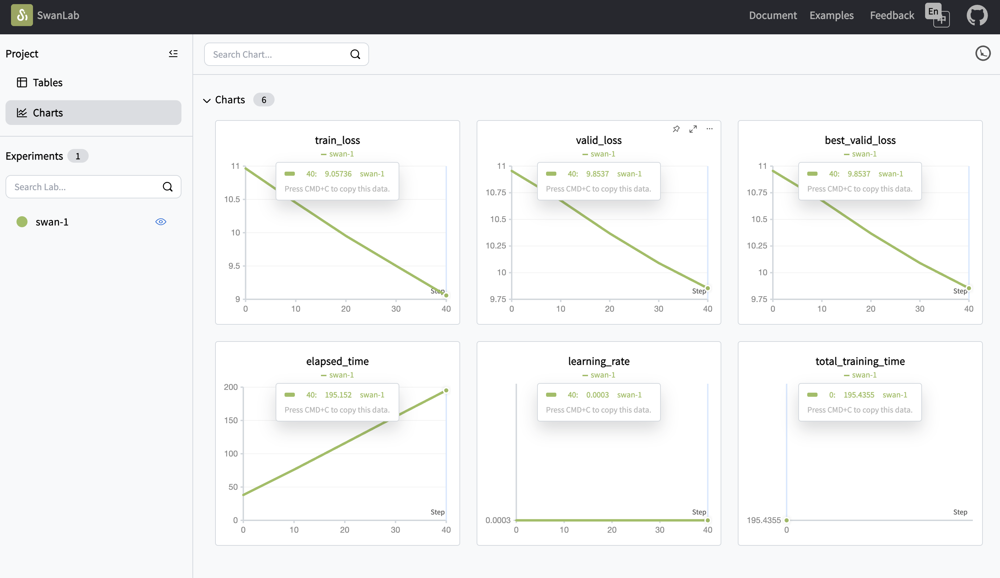

# Build a Tiny Transformers (GPT2)
This repository contains my code and notes for implementing a tiny decoder only transformers(124M GPT2).
Training data is the FineWeb-Edu 10B tokens dataset, I used the tokenized version on [Kaggle](https://www.kaggle.com/datasets/minhthiennguyen/fineweb-edu-10bt-for-gpt2/data).

Following Andrej Karpathy's YouTube video [Let's build GPT: from scratch, in code, spelled out](https://www.youtube.com/watch?v=kCc8FmEb1nY&t=6576s)
and [Let's reproduce GPT2]. 
This repo was forked from the lecture's [repo](https://github.com/karpathy/ng-video-lecture)

## High Level Architecture of GPT2 Model and Training
1. The GPT2 Language Model
   2. Byte-pair encoding tokenization
   3. Build contextual embedding with the attention mechanism
   3. The transformer block data flow: idx -> token+positional embedding -> 12 layers of Block (Attention + MLP + LayerNorm)  -> Final layer norm -> projection back to vocabulary space -> softmax for next token prediction
4. The Training
   5. Prepare data loader
   6. Initialize the GPT2 model parameters with down-scaled standard deviation. (#stability)
      7. (GPT2 only) (#efficiency) token embedding share the same weights with the final projection head's weights, this aligns the distribution of inputs and outputs
   7. (Forward) Feed sequences of data into GPT2 language model to get the logits
   7. (Backward) Use cross-entropy loss (negative averaged log-likelihood) for gradient descent 
8. The Efficiency Tricks
   9. Limit data transportation between chips and memory by memory hierarchy -> Kernel fusion such as `torch.compile()` and FlashAttention
   10. Cut precision when possible -> Mixed Precision of float32 and float16 
   11. Set all hyperparameters to be powers of 2, because this is CUDA works with chunks of 32 and 64, so making our parameters in the same way is a better utilization of GPU resources.
8. The Optimization Techniques (from GPT3 paper)
   9. AdamW: adding momentum(2nd, 3rd derivatives) to gradient(1st derivative) descent, to make SGD go faster. (confirm: AdamW is not changing learning rate, but to change the gradients itself.)
   10. Gradient Clipping: adding a normalization to the gradient vector. Rational: bad batch of data in the training could cause the loss to be very high, making the gradients to be very big too, causing a "shock" to the model.
9. The Model's Output
   9. The model output is a prediction(aka, generation) of next token given a sentence.
   10. The output probability per token distribution contains the latent information of what's including and before the current token, it's a conditional probability distribution over all past tokens within the context window.
9. How to Evaluate the Model
9. Deployment

## Daily training observations
**2025/12/03**
With the Experiment Config (small layers and n_embd) Overfit a single batch of data would land the training loss and valid loss both to 9. 
Iterate over 50 batches doesn't change the loss too much. The loss indicates underfitting.
What make a difference was to switch to the GPT2DataConfig (with bigger n_embd,  n_layers), the valid loss goes to 6.8, much better. Total training takes 24 mins which is very slow.

**2025/12/05**
Add the GPT2 (1) weight sharing scheme between token embedding weights and the lm_head weights and (2) initialization tricks.
(1) improved training efficiency by reducing the number of parameters to be trained by 30% (size of wte is 768*50257= 38M, which is 38M/124M = 30% of the 124M parameters). However the total training time increased and the valid loss also increased a little bit.
(2) initialization tricks does decrease the loss a little bit

**2025/12/08**
Implementing the mixed precision (TF32 and BF16) and kernel fusion(torch.compile) doesn't speed up the training at all. 
Possible reason is that my batch is to small (B = 4, T = 32), so the efficiency tricks cannot make a difference.

**2025/12/09**
Implementing FlashAttention achieved 13% decrease in total training time (baseline 30mins -> 26mins).
Changing vocab_size from an odd number(50257) to the powers of 2(50304) in theory should make training 3x faster, yet with the small data on my MPS this efficiency doesn't show up at all.

**2025/12/31**
Finally setup a cloud GPU (4090D), completing the same task (B=4, T=32, 20 iterations) takes only 2.5mins, which is 5.6 times faster!
Callout: with 24 GB VRAM, B=64 and T=1024 still triggers OOM. So I have to downsize B to 8, (without gradient accumulation), the peak GPU memory utilization is 11133MiB = 10GB, which means that B can be doubled up to 16, which will utilize 20GB, that's not exceeding the 24GB memory.
Total training time is 19min 51s. Train loss 6.1, best and final valid loss is 6.2, no overfitting, yay! See you in 2026!

**2026/01/02**
- Enabled gradient accumulation and temporarily remove the validate loss calculation, it takes only **25 seconds** to complete training task(B=16, T=1024, accumulate gradient=2)! Validation really eat up a lot of time!
- Enabled learning rate scheduler with Cosine Decay, test run with max_step =50 and validated the decay

## Blogs:
### Attention is All You Need readout
1. [Done] Self attention: is the aggregation aim for predicting the last token? [link to blog](notes/self_attention_what_exactly_is_the_QKV_aggregation_doing.md)
5. [Done] where is the K, Q, V weights training happens? [link to notes](notes/Is_training_of_QKV_happens_with_training_embedding.md)
6. Can I interpret the meaning blobs inside K, Q, V? like CNN
4. What are the different variations of transformers, eg. for large models and small models
2. what is residual path
4. Why is a blog marked fig.2 of the attention paper to be:encode as BERT and decode as GPT. 
   Short Answer: The Attention is All You Need paper Figure 2 contains an encoder and decoder connected by a cross-attention sharing of Q and K. However, none of the BERT and GPT models implemented this encoder+decoder architecture: BERT is an Encoder that is trained to look both directions of the sequence and make any position prediction, while GPT is a Decoder because it's products ChatGPT is a human chat format which naturally goes left to right sequence understanding and generation.

### Evaluation during training

1. What are the metrics to evaluate how good the trained GPT is?
2. How to observe these metrics?
3. Can I visualize or test the intermediate output of the GPT?

### More
1. Now that I know how to write the core code of GPT2, how to use different models on HuggingFace? Start with the GPT family (GP2, GPT3, GPT-oss)
2. 