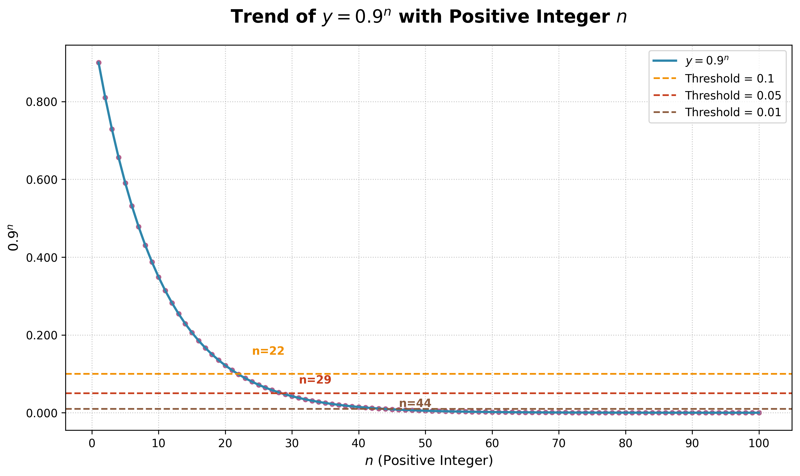

# Variations of the SGD Optimizer that Makes Training Faster

SGD(Stochastic Gradient Descent) is the core of optimizing the model parameters by finding the path to decrease the differences between model prediction and the true labels. 

The vanilla SGD optimizer update the parameters' weight with the following formula
$$ weights \mathrel{-}= learning\_rate \times weights.gradient $$

Here, the $learning\_rate$ is a fixed number and same for all dimensions of the weights vector and $weights.gradient$ is determined solely on one batch of data.


In high dimensional parameter spaces such as a transformers deep neural network, the loss landscape has a complex geometry with variations of gradients. Vanilla SGD is vulnerable w.r.t gradient fluctuations. An exploding gradient(e.g. weight.gradient > $10^2$) would let the parameter make a huge change that causes divergence. On the contrary, a near-zero gradient in saddle points would not make effective changes to the parameter. Both cases slow down the training.

We can make a few changes to the SGD Optimizer to make it adapt to different points and steps of the training process, here's a few tricks:

## 1. Momentum
Momentum simply refines $weights.gradient$ with moving averages of $weights.gradient$, changing the weights update formula to be:
$$ weights\_gradient\_avg_{t} = \beta \times weights\_gradient\_avg_{t-1} + (1-\beta) \times weights.gradient_{t} $$
$$ weights \mathrel{-}= learning\_rate \times weights\_gradient\_avg $$

$\beta$ is usually 0.9, meaning the effect of the gradient at any step will decay to near zero after around 50 steps.

Momentum has 2 main benefits:
1. it maintains inertia in the direction of consistent gradient signals (e.g., if gradients for a dimension are consistently positive, momentum amplifies this direction to accelerate convergence). 
2. it can effectively prevent the training to be stuck at a local minimum (that have 0 gradients).

However, momentum also has it's inherit limitations: it struggles with erratic gradient directions, where the gradient goes down in one step but going back up in the next step. 
This zigzag movement is pretty common due to high-dimensional parameter space, noisy mini-batch, non-convex loss landscape (e.g. saddle points and valleys) and sparse gradients in embedding training where only a small subset of the parameters have a non-zero gradients.

Adaptive step sizes and gradients smoothing algorithms such as RMSProp and Adam are designed to tackle this problem.

## 2. RMSProp to prevent vanishing and exploding step size
### 2.1 Rationale
During training, gradients vary drastically across parameters and iterations, here are 2 examples:
- Gradients of the same parameter fluctuate drastically due to "seeing" different mini-batch data in different iterations
- Gradients of different parameters changes differently due to their position in the deep neural network, eg. earlier layers change less than later layers

These gradient instabilities give rise to vanishing or exploding step sizes, which introduce a "shock" to model training that can halt the training process entirely in the worst-case scenarios.
RMSProp improves the vanilla SGD by allowing each parameter in the weights vector to update with a step size that is stabilized by the gradient's volatility.


### 2.2 The Math
The core formula of RMSProp is to divide the global learning rate by a transformation of $gradient^2$, which makes the step size smaller for parameters with very large gradients 
and vice versa for those with small gradients. To ensure consistency across iterations, RMSProp introduces 
a moving weighted average of $gradient^2$ at each step to aggregates gradient signals over multiple iterations:
$$ weights\_grad\_squared\_avg_{(t)} = \alpha \times weights\_grad\_squared\_avg_{(t-1)} + (1-\alpha) \times gradient_{(t)}^2 $$
the $\alpha$ control how much historical $gradient^2$ weighted average should be considered at the current step.

At step $t=1$, $ weights\_grad\_squared\_avg_{(1)} = (1-\alpha) \times gradient_{(1)}^2$

And we change the vanilla SGD into 
$$ weights \mathrel{-}=  \frac{weights.gradient} {\sqrt{weights\_grad\_squared\_avg + eps}} \times learning\_rate $$
Since the moving weighted average of the squared gradients sits in the denominator, it will enable:
1. if a parameter(a dimension of the weight vector) has a tiny moving average of gradients in the past few steps(indicating it was trapped at a local minimum or well optimized), we shall make its step size to be larger than the vanilla SGD. Note that since the `weights.gradient` is small, the adjusted step size won't be very huge. 
2. on the other hand, if a parameter has a big moving average of gradients in the past few steps(indicating this parameter is jumping everywhere, possibly diverging), let's decrease the step size to keep the updates stable.

Noted the $eps$ is to prevent zero denominator, it's usually 1e-8.

### 2.3 The Key to RMSProp
Does $ \frac{weights.gradient} {\sqrt{weights\_grad\_squared\_avg + eps}}$ equal to 1? If so, then each parameter would only step the global learning rate by each iteration? Then what's the point of feeding gradients? 

For the 1st question, let's revisit the 
$$ weights\_grad\_squared\_avg_{(t)} = \alpha \times weights\_grad\_squared\_avg_{(t-1)} + (1-\alpha) \times weights\_grad_{(t)}^2 $$

Let's start with a perfect scenario example: if $weights\_grad_{(t)}$ is the same for the past few iterations,
then $weights\_grad\_squared\_avg_{(t-1)} = weights\_grad_{(t)}^2$, if $\alpha=0.5$ then $weights\_grad\_squared\_avg_{(t)} = weights\_grad_{(t)}^2$
finally leading to 
$$ \frac{weights.gradient} {\sqrt{weights\_grad\_squared\_avg + eps}} \times learning\_rate = \pm 1 \times learning\_rate $$

Here, $\pm1$ reviles one of the critical things that gradients control: the direction of the updates.

By convention $alpha = 0.99$, so if the $weights\_grad_{(t)}$ is stable for the past few iterations then $ \frac{weights.gradient} {\sqrt{weights\_grad\_squared\_avg + eps}} \approx \pm1$,
but if $weights\_grad_{(t)}$ suddenly spike up then the fraction would deviate from $\pm1$ (but not too much) and the next few iterations would make the fraction return to near 1 magnitude.

This is the genius of RMSProp: it decouples "gradient magnitude" from "step size stability"—so neither parameter dominates the update process, and converge at a reasonable rate.

## 3. Adam
Adam (Adaptive Moment Estimation) represents a sophisticated synthesis between momentum and RMSProp,
the update step is a simple combination of the two:
```
# beta1 is the momentum parameter, beta2 is the RMSProp parameter
# Momentum
w_g_avg = beta1 * w_g_avg + (1-beta1) * w.grad
unbias_w_g_avg = w_g_avg/(1-beta1**(i+1))
# RMSProp
w_g_sqrt_avg = beta2 * w_g_sqrt_avg + (1-beta2) * w.grad**2
new_w = w - lr * unbiased_w_g_avg/sqrt(w_g_sqrt_avg + eps)
```
Normally $(\beta1, \beta2, \epsilon) = (0.9, 0.999, 1e-8) $.

Noted for the `unbiased_w_g_avg`, if we are the i-th iteration (starting at 0), this divisor of
$1 - \beta^{(i+1)}$ makes sure the unbiased average looks more like the gradients at
the beginning (since beta < 1, the denominator is very quickly close to 1).


## 4. AdamW
Fused Adam


## 5. Other Techniques 
- Batch size tuning,
- Learning rate scheduler
- Gradient Clipping, 
- Weight Decay,
- Gradient Accumulation


### Batch size tuning
Start with small batch size and increase overtime. This is computationally heavy, it's not an algorithmic optimization but rather a system and speed improvement.

Why small to large batch size?

At the beginning of the training, the model is learning very basic things: which tokens are commonly used versus which ones are not and therefore should be ignored. So the gradients from every single examples are highly correlated (they all look roughly the same because they are all telling which tokens appeared or not) and there's no difference between learning small batch size and large batch size.
Once the basic frequent-or-not pattern has been learned by the model, it then makes sense to feed large sentences of data so that the gradients are more de-correlated, and we can learn complex patterns with statistical power.


## Coding tips

1. Momentum: we should record the average of each dimension of the gradient vector and update each dimension of the weight accordingly, 
rather than averaging all the dimensions of the weights vector (that's more like a normalization which computes a unified statistic across all dimensions).


## Appendix: 
### 1. Causes and solutions with gradient vanishing and exploding
| Gradient Issue            | Common Causes                                                                                                                                                    | Common Fixes                                                                                                                                                                                                                                               |
|---------------------------|------------------------------------------------------------------------------------------------------------------------------------------------------------------|------------------------------------------------------------------------------------------------------------------------------------------------------------------------------------------------------------------------------------------------------------|
| **Huge Gradients**        | 1.Input data have different magnitudes<br> 2. Initialized weights to large values $e.g. N(10,1)$ causing huge activations and derivatives<br> 3. outlier batches | 1. Normalize input data/features<br>2. Use He/Xavier weight initialization<br>3. Add gradient clipping (e.g., `torch.nn.utils.clip_grad_norm_`)<br>4. Remove outlier batches or use robust loss functions (e.g., Huber loss instead of MSE)                |
| **Near-Zero Gradients**   | 1. Activation function saturation, e.g. Sigmoid and Relu<br> 2. Flat regions in the loss landscape<br> 3. Overregularized                                        | 1. Replace sigmoid/tanh with Leaky ReLU/GELU/Swish<br>2. Reduce weight decay or dropout rate<br>3. Use residual connections (ResNets) to enable gradient flow through deep layers<br>4. Increase learning rate (if gradients are small due to convergence) |

### 2. Gradient Norm Clipping 
After gradient is precomputed(stored in `param.grad`) with `loss.backward()`, apply the Norm Clipping to cap the gradients vector.
Gradients clipping is not part of the optimizer, because the optimizer DOES NOT modify the gradients it only modifies the parameters/weights.

### 3. Connections between Weight Decay and L2 Regularization 
As the name speaks for itself, weight decay simply means that the **weight** is decayed by some factor. 
In the case of vanilla SGD, weight decay is as simple as:

$$ new\_w = w - lr \cdot grad - decay \cdot lr \cdot w $$

This is the same as L2 regularization that penalize weights on loss function:

$$ loss = y\_gt - w\Tx - w^2 $$

### 4. Gradients memory length is determined by the $0.9^n$  



