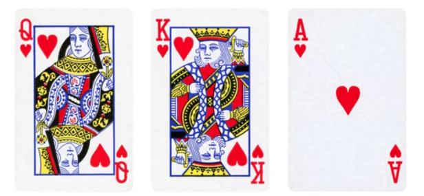

# Q, K, V of Self Attention Explained
What is produced by `attention @ V`?



## TL;DR
The self attention can be broken down into 2 conceptual pillars:
1. The **Attention Weights** blob preserves the pairwise similarity between tokens within each sequence and each batch. Similarity is based on the dot product of `Q` and `K`, where `Q` stands for what the token is looking for and `K` as what each token offers.
Each row represents a probability distribution showing how much a given token should attend to every other token (including itself) when building contextual meaning.
2. The **Contextual Embedding**, aka the weighted average of attention over `V`.
Every token's contextual embedding vector would be the sum of its' attention weights over other tokens times the **information (values)** of other tokens, this produces a context-aware representation that blends information from all relevant tokens according to their learned importance.

What I found deeply astonishing is the connection between CNN and Self Attention, both do weighted aggregation over local neighbors and both decouple the task of learning different features to multiple heads/filters.

## Attention

Let’s recall what Q, K, V means:

| Symbol | Meaning                                               | Shape      |
| :----- | :---------------------------------------------------- | :--------- |
| **Q**  | queries (what each token is “asking for”)             | (B, T, hs) |
| **K**  | keys (what each token “offers”)                       | (B, T, hs) |
| **V**  | values (the actual information content of each token) | (B, T, hs) |


4 Major steps in attention calculation:

| Step                  | Meaning                                                               |
|:----------------------| :-------------------------------------------------------------------- |
| $(QK^T / \sqrt{h_s})$ | raw *affinity map* — how related each token is to others              |
| `mask`                | prevents tokens from seeing the future                                |
| `softmax`             | converts affinities into probabilities (attention weights)            |
| `@ V`                 | aggregates information from relevant tokens into a new representation |

### 1. Affinity Map/Matrix

$$ \text{affinity matrix} = Q K^T / \sqrt{h_s} $$ 

dimension (B,T,T)

Caution: B(Batch size) is the number of sequence here, T(time steps) is the number of tokens in each sequence. T is not number of sequence.
Here, for every sequence b, we have a (T,T) matrix that represents the affinity of token $i$ vs token $j$, $(i,j)$ in $range(1,T)$.

Each element of the **affinity matrix** is a single scalar value represents how much token *i* (the “query”) attends to token *j* (the “key”):

$$ \text{Affinity}[i, j] = Q_i \cdot K_j = (Q_{i1} \times K_{j1}) + (Q_{i2} \times K_{j2}) + ... + (Q_{i_{hs}} \times K_{j_{hs}}) $$

👉 $ \text{Affinity}[i,j] $ collapses the 3D (head-size) feature space into **one similarity score** via a **dot product**.

The whole **affinity matrix** will be:

$$
\begin{bmatrix}
Q_1 \cdot K_1 & Q_1 \cdot K_2 & Q_1 \cdot K_3 & Q_1 \cdot K_T \\\\
Q_2 \cdot K_1 & Q_2 \cdot K_2 & \dots & \dots \\\\
\vdots & \vdots & \ddots & \vdots \\\\
Q_T \cdot K_1 & \dots & \dots & Q_T \cdot K_T
\end{bmatrix}
$$


### 2. (Decoder only) Lower triangular mask
Within each sequence, the purpose of the mask is to limit the affinity of every token to only look at itself and tokens before it. Token 1 can only look at itself, token 2 can look at token 1 and 2, etc.
Note that, after masking, the first row of the (T,T) will always be $[1, 0, 0, .., 0]$. Since it's always the same, dropouts and padding can do special default treatment to the first row.

### 3. What is the Weight produced by softmax?

$$ \text{Weights}[b, t, :] = \text{softmax}(\text{Affinity}[b, t, :]) $$

For token t in sequence b, $[b,t,:]$ stands for this token's affinity/attention with all the other T tokens of the same sequence.
Each row of the softmax weight matrix is a probability distribution over **which tokens within the same sequence are most semantically or contextually related**.
In decoder, the lower triangular mask only allows each token to look back, as a result we will see all $[b,t, t+1:T]$ entries are 0.

### 4. The aggregation 
The weights produced by the softmax are then used for calculating the weighted average of $V$
$$ \text{output} = \text{weights} @ V $$
→ shape = (B, T, hs)

Each row `output[b, t, :]` = weighted sum of the **values** of all tokens up to *t*.

So:

* Token 1 → sees itself only.
* Token 2 → sees token 1 and 2.
* Token 3 → sees 1, 2, 3.
* …
* Token T → sees all tokens 1 … T.

🎯 What the weighted average represents

Each position *t* in the output sequence represents the model’s **contextualized embedding of the token at position t**, summarizing all information available **up to and including t**.

## What happens after the attention models the contextual embeddings
The weighted average is *not* yet the *next-token prediction*.
Rather, it’s an **intermediate representation** that later flows into the feed-forward layers (and possibly more attention blocks), and **only at the final layer’s output** do we project it to logits for predicting the **next token**.

At training time for language modeling:

* For every token position *t*, the model’s output at that position (`output[b, t, :]`) is projected (via a linear layer) to predict the *next token* at position *t + 1*.

So:

```text
output[:, 0, :] → predicts token_1
output[:, 1, :] → predicts token_2
...
output[:, T-1, :] → predicts token_T
```

Thus, **all tokens** in the sequence contribute predictions in parallel — not only the last one.


### Let's look at a concrete example
Suppose B = 3, T = 5, we have a weight vector 
$$\text{weight}[b=2,t=3,:] = [0.5, 0.2, 0.3, 0, 0]$$
This means that, for sequence number 2 of this batch, for the 3rd token, it's probability distribution of affinity, aka, how much attention shall I pay to each one of the tokens, can be contextually intepreted as :

| Token index | Meaning | Probability | Interpretation                        |
| :---------- | :------ | :---------- | :------------------------------------ |
| 1           | Token₁  | 0.5         | token₃ finds token₁ highly relevant   |
| 2           | Token₂  | 0.2         | token₃ finds token₂ somewhat relevant |
| 3           | Token₃  | 0.3         | token₃ attends partially to itself    |
| 4           | Token₄  | 0           | masked (future)                       |
| 5           | Token₅  | 0           | masked (future)                       |

Mathmatically speaking:

$$ \text{weights}[b=2,t=3,:] = \text{softmax}(Q[b=2,t=3,:] \cdot K[b=2,:,:]^T / \sqrt{h_s}) $$

$Q[b=2,t=3,:]$ is the query of sequence 2 - token 3, $K[b=2,:,:]$ is the keys of every token in sequence 2.
The dot product of these 2 represents: for token 3 in sequence 2, how is every token's information in my current sequence match with what am I asking for.

The aggregation (weighted average)

$$ \text{Output}[b=2, t=3, :] = \text{weights}[b=2,t=3,:] * \text{V}[b=2, :, :] $$

Can be rewritten as *uses these weights to take a weighted average of the corresponding Value vectors*:

$$ O_{b=2,t=3} = 0.5v_1 + 0.2v_2 + 0.3v_3 $$

So the output embedding for token₃ now “summarizes” the most relevant prior information.

To make the values of $v_1, v_2, v_3$ clearer, let's say $\text{V}[b=2, :, :]$ is a high level representation of the (5 token) sequence 2 to be: ["I", "am", "a", "cat", "lover"]

Then the $\text{Output}[b=2, t=3, :]$ is equal to the weighted averaged information of within the first 3 tokens of sequence 2 as $0.5*I + 0.2*am + 0.3*cat$, this weighted average is the contextual embedding vector of token 3 at sequence 2, the vector's dimension is $(1,1, head size)$.

If `head_size = 3` and $V_{b=2}$ took the following values:
```
V = torch.tensor([
    [ 1.,  0.,  0.],   # v1: "I"
    [ 0.,  1.,  0.],   # v2: "am"
    [ 0.,  0.,  1.],   # v3: "a"
    [ 2.,  2.,  2.],   # v4: "cat"
    [-1.,  1.,  0.],   # v5: "lover"
])  
```
Then 

$$\text{Output}[b=2, t=3, :] = 0.5*I + 0.2*am + 0.3*cat = [0.5, 0.2, 0.3]$$

Noted that $\text{Output}[b=2, t=3, :]$ is not a probability over vocabulary; it’s the representation that will be fed forward (and later projected) to produce logits for predicting the next token at sequence 2 position 4.


2025/11/07 Followups
## Does the contextual embedding created by Q,K,V the same thing as the token embedding

Short answer: **No—they’re different things**, even though they share the same shape ([B,T,C]).

* **Token embedding (static):**
  You start with an embedding lookup $E\in\mathbb{R}^{V\times C}$. For each token id, you grab a row of $E$ (and add position info) to get $X^{(0)}\in\mathbb{R}^{B\times T\times C}$. This vector depends only on the token (and position), **not** on its neighbors.

* **Contextual embedding (context-dependent “hidden state”):**
  After passing through self-attention and the MLP (plus residuals/LayerNorm), you get $X^{(l)}$ (or $X^{(L)}$ at the top). This representation **does** depend on surrounding tokens—the “context.”

* **Where Q/K/V fit:**
  Within a layer, you form
   $$ Q = X^{(l)}W_Q,\quad K = X^{(l)}W_K,\quad V = X^{(l)}W_V. $$
  The attention output is
  
  $$\text{Attn}(X^{(l)})=\text{softmax}!\left(\frac{QK^\top}{\sqrt{d_h}}\right)V\ \xrightarrow{\text{concat heads}}\ \cdot W_O, $$
  then residual + MLP → $X^{(l+1)}$.
  **Q/K/V are intermediate projections**, not embeddings you keep; the **contextual embedding is $X^{(l+1)}$** (or any layer’s hidden state), produced *using* Q/K/V.

* **Why the confusion:**
  Shapes match (([B,T,C])), and some code calls these tensors “embeddings.” But:

  * **Token embedding** = lookup from (E).
  * **Contextual embedding** = the layer outputs (hidden states) after attention/MLP.
  * **Q/K/V** = temporary, per-head feature spaces used to *compute* attention weights and payloads.

* **Bonus (LMs):** many LMs **tie** the output softmax weights to the input embedding $E$ (use $E^\top$ to get logits). That’s another reason both ends live in the same (C)-dim space—but the hidden states are still contextual, not the same as the original token lookup.


## Analogy between CNN and Self Attention
I see that each self attention output a size (B,T,C) contextual embedding matrix that tells the aggregated information of how each token's value aggregates over other token's affiliation within the same sequence. Based on that, I feel that this almost like Convolutional Neural Net where the convolution kernel gets local relationships, do you think this analogy make sense?

Short answer: the analogy helps, but only **partly**. Here’s a crisp map of where it fits and where it breaks.

### Why the analogy works

* **Weighted aggregation of neighbors.**
  A 1-D conv at position (t) does $y_t=\sum_{\Delta\in\mathcal K} w_\Delta , x_{t+\Delta}$.
  Self-attention does $y_t=\sum_{s=1}^{T} \alpha_{t,s}, V_s$ with $\alpha_{t,s}=\text{softmax}*s(Q_t \cdot K_s/\sqrt{d_h}+b_{t,s})$.
  It’s the *same structural pattern*: take a neighborhood (conv: fixed local window; attention: potentially **all** tokens) and form a weighted sum.

* **Causal/local variants feel even more conv-like.**
  Causal masks (only attend to $s\le t$) mimic a **causal 1-D conv**. Local attention (restrict $|t-s|\le W$) ≈ conv with kernel size $2W{+}1$.

* **Multiple heads ≈ multiple filters.**
  Each head learns a different “view,” akin to multiple conv kernels capturing different features.

### Where it breaks down

* **Static vs. input-conditioned kernels.**
  Convs use the **same weights** everywhere (translation equivariant, Toeplitz).
  Attention’s “kernel” $\alpha_{t,s}$ is **data-dependent** (changes with the sequence), and it’s **normalized** (softmax). This makes attention *adaptive* and *non-stationary*.

* **Receptive field.**
  Convs are **local by design** (unless dilated/many layers).
  Attention is **global in one hop** (O$(T^2)$ pairs), so it captures long-range dependencies without stacking depth or dilation.

* **Positional bias.**
  Convs bake in translation equivariance; they don’t need position encodings.
  Attention **needs** positional info (absolute, relative, or rotary) to know “who’s near whom.” Without it, it’s permutation-invariant.

* **Computation & memory.**
  Conv: O$(T\cdot k\cdot C^2)$ or better, very cache-friendly.
  Full attention: O$(T^2\cdot C)$ memory/compute for scores; many variants exist to tame this (local, sliding-window, low-rank).

* **Inductive bias vs. flexibility.**
  Convs have a strong locality/translation bias—great when patterns are spatially local and repeated.
  Attention has a weaker prior but greater flexibility—can learn both local *and* arbitrary long-range structure.

### Useful mental model

> **Self-attention is like a content-aware, globally connected “convolution” whose kernel is computed from the input itself and changes at every position and every example.**

### Practical implications

* Early Transformer layers often learn **local** patterns (heads focus near the diagonal), resembling convs; deeper layers increasingly capture **long-range** structure.
* If your task is known to be local (e.g., certain audio/vision pipelines), **local/relative-position attention** or even **hybrid conv–attention** blocks (Conv + MHSA) can be compute-better and inductive-bias-friendlier.
* Conversely, for language with long contexts, attention’s **adaptive global** mixing is the win that classic convs need many layers/dilation to approximate.

So: your intuition is good—think of attention as a *dynamic, input-conditioned generalization* of convolution, with global reach and weaker built-in priors.

